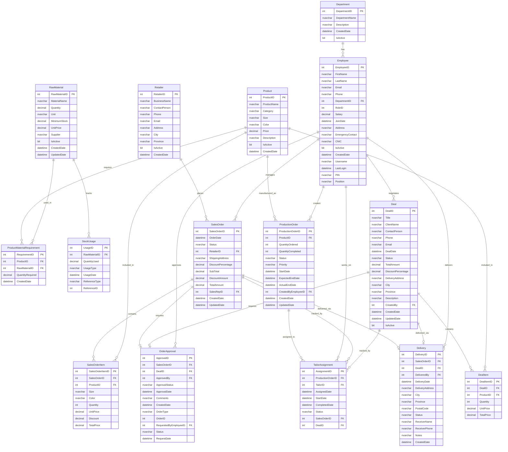
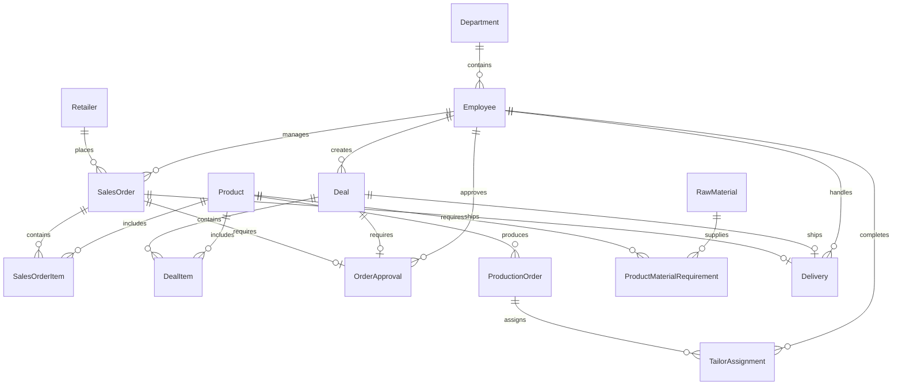
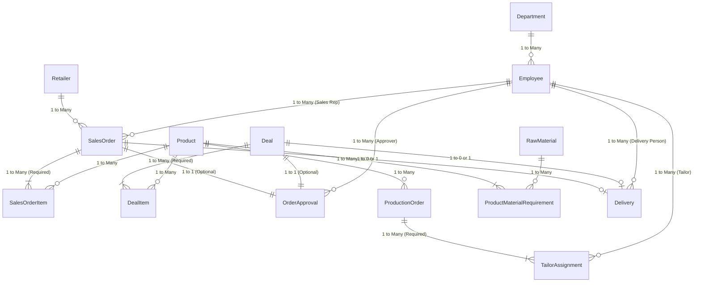

# GARMENTS FACTORY MANAGEMENT SYSTEM - ER DIAGRAM (MERMAID)

## Instructions for Mermaid
Copy the code below and paste it into:
- Mermaid Live Editor: https://mermaid.live/
- Or any Mermaid-compatible tool

The diagram will automatically generate showing all tables, columns, and relationships.

---

## Mermaid ERD Code



---

## Simplified View (Core Entities Only)



---

## Advanced View (With Cardinality Details)



---

## Table Relationships Summary

### One-to-Many Relationships
1. **Department → Employee**: One department has many employees
2. **Retailer → SalesOrder**: One retailer places many sales orders
3. **Employee → SalesOrder**: One sales rep manages many sales orders
4. **SalesOrder → SalesOrderItem**: One sales order contains many items
5. **Product → SalesOrderItem**: One product appears in many order items
6. **Employee → Deal**: One employee creates many deals
7. **Deal → DealItem**: One deal contains many items
8. **Product → DealItem**: One product appears in many deal items
9. **Employee → OrderApproval**: One employee approves many orders
10. **Product → ProductionOrder**: One product has many production orders
11. **ProductionOrder → TailorAssignment**: One production order assigned to many tailors
12. **Employee → TailorAssignment**: One tailor works on many assignments
13. **Product → ProductMaterialRequirement**: One product requires many materials (BOM)
14. **RawMaterial → ProductMaterialRequirement**: One material used in many products
15. **Employee → Delivery**: One delivery person handles many deliveries

### One-to-One Relationships
1. **SalesOrder ↔ OrderApproval**: Each sales order has one approval request (optional)
2. **Deal ↔ OrderApproval**: Each deal has one approval request (optional)
3. **SalesOrder ↔ Delivery**: Each sales order has one delivery (optional)
4. **Deal ↔ Delivery**: Each deal has one delivery (optional)

### Many-to-Many Relationships (via Junction Tables)
1. **Product ↔ RawMaterial** (via ProductMaterialRequirement): Products require multiple materials, materials used in multiple products

---

## Key Database Constraints

### Primary Keys
- All tables have auto-incrementing integer primary keys
- Format: TableNameID (e.g., EmployeeID, SalesOrderID)

### Foreign Keys
- Enforce referential integrity
- Cascade rules vary by relationship
- Soft deletes used (IsActive flag) to maintain integrity

### Unique Constraints
- Employee.Username (unique per employee)
- Employee.Email (unique per employee)
- Product.ProductName (unique per product)

### Check Constraints
- Quantity fields must be > 0
- Prices must be >= 0
- Discount percentages between 0 and 100
- Status fields limited to predefined values

### Default Values
- CreatedDate defaults to GETDATE()
- IsActive defaults to 1 (true)
- Status fields default to 'Pending'

---

## Business Rules Enforced by Schema

1. **Order Validation**
   - Sales orders must have at least one item
   - Order total calculated from items
   - Cannot approve orders without items

2. **Material Management**
   - Products must define material requirements (BOM)
   - Material deduction happens on approval
   - Stock cannot go below zero (validated)

3. **Production Workflow**
   - Production orders created after approval
   - Multiple tailors can work on same order
   - All tailors must complete before delivery

4. **Delivery Automation**
   - Delivery created when production completes
   - Links to original sales order or deal
   - Requires delivery personnel assignment

5. **Data Integrity**
   - Soft deletes preserve relationships
   - Transactions ensure atomic operations
   - Foreign keys prevent orphaned records

---

## ER Diagram Legend

### Cardinality Symbols
- `||--o{` : One to Many (One-to-Zero-or-More)
- `||--|{` : One to Many (One-to-One-or-More, required)
- `||--||` : One to One (Exactly One)
- `||--o|` : One to Zero or One (Optional)

### Attribute Types
- `PK` : Primary Key
- `FK` : Foreign Key
- `int` : Integer
- `nvarchar` : Variable-length Unicode string
- `decimal` : Decimal number
- `datetime` : Date and time
- `bit` : Boolean (0 or 1)

---

## How to Use This Document

### For Mermaid Live Editor:
1. Go to https://mermaid.live/
2. Copy one of the code blocks above (starting with ```mermaid)
3. Paste into the editor
4. The diagram will render automatically
5. Export as PNG, SVG, or PDF

### For Documentation:
1. Copy to Markdown files
2. GitHub automatically renders Mermaid diagrams
3. Use in README.md or technical documentation
4. Embed in Confluence, Notion, or similar tools

### For Presentations:
1. Render diagram in Mermaid Live
2. Export as high-resolution image
3. Import into PowerPoint/Google Slides
4. Use simplified view for overview slides
5. Use detailed view for technical slides

---

## Tips for Best Results

### Zoom and Layout
- Use simplified view for presentations
- Use detailed view for technical documentation
- Mermaid auto-arranges layout
- Export at high DPI for print quality

### Customization
- Add colors using CSS themes
- Adjust spacing with rankdir TB/LR
- Group related tables visually
- Highlight critical paths

### Maintenance
- Update when schema changes
- Version control with Git
- Include in database migration docs
- Review during code reviews

---

**Created:** December 15, 2025  
**Database:** GarmentsFactoryDB  
**Tables:** 15+ core entities  
**Relationships:** 20+ foreign keys  
**Format:** Mermaid ERD Syntax
