# Factory Management System - Complete ERD Diagram

Copy the code below and paste it into any Mermaid viewer (like [Mermaid Live Editor](https://mermaid.live/))

```mermaid
erDiagram
    %% ========== EMPLOYEE & ROLE MANAGEMENT ==========
    EmployeeRole ||--o{ Employee : "has role"
    Department ||--o{ Employee : "works in"
    
    Employee ||--o{ SalesOrder : creates
    Employee ||--o{ Deal : creates
    Employee ||--o{ ProductionOrder : manages
    Employee ||--o{ TailorAssignment : "assigned to"
    Employee ||--o{ Delivery : delivers
    Employee ||--o{ OrderApproval : approves
    Employee ||--o{ Stock : manages
    
    %% ========== RETAILER & ORDERS ==========
    Retailer ||--o{ SalesOrder : places
    
    SalesOrder ||--|{ SalesOrderItem : contains
    SalesOrder ||--o| OrderApproval : "requires approval"
    SalesOrder ||--o| Delivery : "delivered via"
    
    %% ========== DEALS ==========
    Deal ||--|{ DealItem : contains
    Deal ||--o| OrderApproval : "requires approval"
    Deal ||--o| Delivery : "delivered via"
    
    %% ========== PRODUCTS & INVENTORY ==========
    Product ||--o{ SalesOrderItem : "ordered in"
    Product ||--o{ DealItem : "included in"
    Product ||--o{ ProductionOrder : "produced as"
    Product ||--o{ ProductMaterialRequirement : "requires materials"
    Product ||--o{ Stock : "stocked as"
    
    %% ========== PRODUCTION ==========
    ProductionOrder ||--o{ TailorAssignment : "assigned to"
    
    %% ========== RAW MATERIALS ==========
    RawMaterial ||--o{ ProductMaterialRequirement : "required for"
    RawMaterial ||--o{ RawMaterialPurchase : "purchased as"
    
    %% ========== FINANCIAL & REVENUE ==========
    MonthlyRevenue ||--o{ SalesOrder : "tracks sales"
    MonthlyRevenue ||--o{ Deal : "tracks deals"
    SalaryPayment ||--o{ Employee : "pays salary"
    MiscExpense ||--o{ MonthlyRevenue : "contributes to"
    
    %% ========== ENTITY DEFINITIONS ==========
    
    EmployeeRole {
        int RoleID PK
        string RoleName
        string Description
        datetime CreatedDate
        bit IsActive
    }
    
    Department {
        int DepartmentID PK
        string DepartmentName
        string Description
        datetime CreatedDate
        bit IsActive
    }
    
    Employee {
        int EmployeeID PK
        string Name
        int RoleID FK
        int DepartmentID FK
        string Phone
        string Email
        decimal Salary
        datetime HireDate
        string Status
        string Username
        string PasswordHash
    }
    
    Retailer {
        int RetailerID PK
        string ContactPerson
        string Phone
        string Email
        string Address
        string City
        string Province
        string BusinessName
    }
    
    SalesOrder {
        int SalesOrderID PK
        int RetailerID FK
        int SalesRepID FK
        datetime OrderDate
        decimal TotalAmount
        string Status
        string ShippingAddress
        datetime CreatedDate
        datetime UpdatedDate
    }
    
    SalesOrderItem {
        int SalesOrderItemID PK
        int SalesOrderID FK
        int ProductID FK
        int Quantity
        decimal UnitPrice
        decimal TotalPrice
    }
    
    Deal {
        int DealID PK
        string DealTitle
        string ClientName
        string ContactPerson
        string Phone
        int CreatedBy FK
        datetime StartDate
        datetime EndDate
        decimal TotalAmount
        string Status
        string DeliveryAddress
        string City
        string Province
    }
    
    DealItem {
        int DealItemID PK
        int DealID FK
        int ProductID FK
        int Quantity
        decimal UnitPrice
        decimal TotalPrice
    }
    
    Product {
        int ProductID PK
        string ProductName
        string Category
        decimal Price
        string Size
        string Color
        int StockQuantity
        string Description
    }
    
    Stock {
        int StockID PK
        int ProductID FK
        string BatchNo
        datetime EntryDate
        int Quantity
        string StockStatus
        int ProgressPercentage
        string Location
        string Notes
        int CreatedBy FK
        datetime LastUpdated
    }
    
    OrderApproval {
        int ApprovalID PK
        string OrderType
        int OrderID
        int SalesOrderID FK
        int DealID FK
        int ApprovedBy FK
        int RequestedByEmployeeID FK
        string ApprovalStatus
        string Status
        datetime ApprovalDate
        datetime RequestDate
        string Comments
        datetime CreatedDate
    }
    
    ProductionOrder {
        int ProductionOrderID PK
        int ProductID FK
        int QuantityOrdered
        int QuantityCompleted
        datetime StartDate
        datetime ExpectedEndDate
        datetime ActualEndDate
        string Status
        string Priority
        string Notes
        int CreatedByEmployeeID FK
        datetime CreatedDate
        datetime UpdatedDate
    }
    
    TailorAssignment {
        int AssignmentID PK
        int ProductionOrderID FK
        int TailorID FK
        int ProductID FK
        int QuantityAssigned
        string Status
        datetime AssignedDate
        datetime CompletedDate
    }
    
    Delivery {
        int DeliveryID PK
        int SalesOrderID FK
        int DealID FK
        int DeliveredBy FK
        datetime DeliveryDate
        string DeliveryAddress
        string City
        string Province
        string Status
        string ReceiverName
        string ReceiverPhone
        string Notes
        datetime CreatedDate
    }
    
    RawMaterial {
        int RawMaterialID PK
        string MaterialName
        string Category
        string Unit
        decimal StockQuantity
        decimal ReorderLevel
        decimal UnitCost
        string Description
    }
    
    RawMaterialPurchase {
        int PurchaseID PK
        int RawMaterialID FK
        string MaterialName
        date PurchaseDate
        decimal Quantity
        string Unit
        decimal UnitPrice
        decimal TotalAmount
        string SupplierName
        string InvoiceNumber
        string Notes
        datetime CreatedDate
    }
    
    ProductMaterialRequirement {
        int RequirementID PK
        int ProductID FK
        int RawMaterialID FK
        decimal QuantityRequired
    }
    
    MonthlyRevenue {
        int RevenueID PK
        int Year
        int Month
        string MonthName
        decimal SalesIncome
        decimal DealIncome
        bit SalariesPaid
        decimal TotalSalaries
        decimal RawMaterialCost
        decimal MiscExpense
        decimal TotalIncome
        decimal TotalExpense
        decimal NetProfit
        string Notes
        datetime CreatedDate
        datetime UpdatedDate
    }
    
    SalaryPayment {
        int PaymentID PK
        date PaymentDate
        int PaymentMonth
        int PaymentYear
        decimal TotalAmount
        int EmployeeCount
        string Notes
        datetime CreatedDate
    }
    
    MiscExpense {
        int ExpenseID PK
        date ExpenseDate
        decimal Amount
        string Category
        string Description
        string PaidTo
        string PaymentMethod
        string ReceiptNumber
        datetime CreatedDate
    }
```

## 📊 Database Overview:

### Total Tables: 21

#### 🏢 **Core Business Entities**
1. **EmployeeRole** - Job roles definition
2. **Department** - Department structure
3. **Employee** - Staff management
4. **Retailer** - Customer base

#### 📦 **Order Management**
5. **SalesOrder** - Retail orders
6. **SalesOrderItem** - Order line items
7. **Deal** - Bulk/contract orders
8. **DealItem** - Deal line items
9. **OrderApproval** - Approval workflow

#### 🏭 **Production**
10. **Product** - Product catalog
11. **ProductionOrder** - Production planning
12. **TailorAssignment** - Work assignments
13. **Stock** - Inventory management

#### 🧵 **Raw Materials**
14. **RawMaterial** - Material catalog
15. **RawMaterialPurchase** - Purchase records
16. **ProductMaterialRequirement** - Bill of materials

#### 🚚 **Delivery**
17. **Delivery** - Shipment tracking

#### 💰 **Financial Management**
18. **MonthlyRevenue** - Revenue & P/L tracking
19. **SalaryPayment** - Payroll records
20. **MiscExpense** - Other expenses

## 📈 Current Database Statistics:

- **Sales Orders**: 14 (Rs. 151,175 total)
  - Delivered: 6 (Rs. 68,900)
  - Approved: 2 (Rs. 27,400)
  - Pending: 5 (Rs. 4,200)
  
- **Deals**: 13 (Rs. 445,122 total)
  - Delivered: 4 (Rs. 199,500)
  - Approved: 9 (Rs. 245,622)

- **Production**: 63 Tailor Assignments
  - Complete: 42
  - InProgress: 10
  - Assigned: 11

- **Deliveries**: 22 total
  - Delivered: 16
  - Pending: 6

- **💰 Total Revenue**: Rs. 268,400 (Delivered orders)

## How to View:

1. **Online**: Go to https://mermaid.live/ and paste the code above
2. **VS Code**: Install "Markdown Preview Mermaid Support" extension
3. **GitHub**: Push to GitHub - renders automatically
4. **Draw.io**: Export from Mermaid Live to other formats
