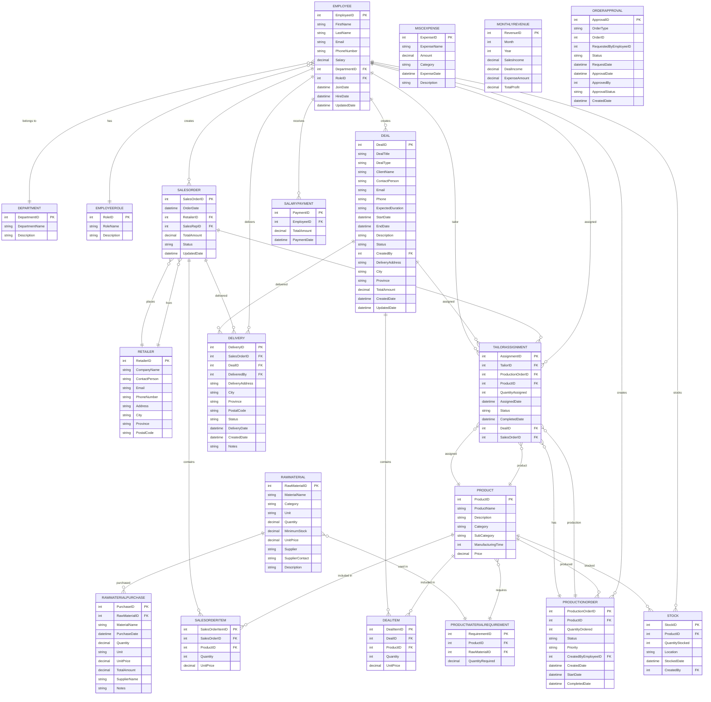

# Factory Management System - ER Diagram

## Entity Relationship Diagram



## Database Schema Overview

### Core Entities

| Entity | Purpose | Key Fields |
|--------|---------|-----------|
| **Employee** | Staff members with roles and departments | EmployeeID, FirstName, LastName, Salary, RoleID |
| **Department** | Organizational departments | DepartmentID, DepartmentName |
| **EmployeeRole** | Job roles (Owner, Manager, Tailor, etc.) | RoleID, RoleName |
| **Product** | Garment products | ProductID, ProductName, Category, Price |
| **RawMaterial** | Raw materials (fabric, thread, etc.) | RawMaterialID, MaterialName, Quantity, UnitPrice |

### Sales & Orders

| Entity | Purpose | Key Fields |
|--------|---------|-----------|
| **Retailer** | Retail customers | RetailerID, CompanyName, ContactPerson |
| **SalesOrder** | Orders from retailers | SalesOrderID, OrderDate, RetailerID, Status |
| **SalesOrderItem** | Line items in sales orders | SalesOrderItemID, SalesOrderID, ProductID, Quantity |
| **Deal** | Special deals/projects | DealID, DealTitle, ClientName, Status |
| **DealItem** | Line items in deals | DealItemID, DealID, ProductID, Quantity |

### Production & Manufacturing

| Entity | Purpose | Key Fields |
|--------|---------|-----------|
| **ProductionOrder** | Manufacturing orders | ProductionOrderID, ProductID, QuantityOrdered, Status |
| **TailorAssignment** | Assign products to tailors | AssignmentID, TailorID, ProductID, QuantityAssigned |
| **ProductMaterialRequirement** | Material needed per product | ProductID, RawMaterialID, QuantityRequired |
| **Stock** | Product stock tracking | StockID, ProductID, QuantityStocked, Location |

### Finance & Logistics

| Entity | Purpose | Key Fields |
|--------|---------|-----------|
| **Delivery** | Order/Deal deliveries | DeliveryID, SalesOrderID/DealID, DeliveryDate, Status |
| **SalaryPayment** | Employee salary records | PaymentID, EmployeeID, TotalAmount, PaymentDate |
| **RawMaterialPurchase** | Purchase tracking (automated) | PurchaseID, RawMaterialID, PurchaseDate, TotalAmount |
| **MiscExpense** | Other expenses | ExpenseID, ExpenseName, Amount, Category |
| **MonthlyRevenue** | Financial summary | RevenueID, Month, Year, SalesIncome, ExpenseAmount |

### Workflow Management

| Entity | Purpose | Key Fields |
|--------|---------|-----------|
| **OrderApproval** | Approval workflow for orders/deals | ApprovalID, OrderType, OrderID, Status, ApprovalDate |

## Key Relationships

### Sales Flow
```
Retailer → SalesOrder → SalesOrderItem → Product
                                      ↓
                            ProductionOrder
                                      ↓
                            TailorAssignment
                                      ↓
                            (Delivery)
```

### Deal Flow
```
Deal → DealItem → Product
         ↓
    ProductionOrder
         ↓
    TailorAssignment
         ↓
    (Delivery)
```

### Material Flow
```
RawMaterial ← (Automated Purchase)
     ↓
ProductMaterialRequirement
     ↓
Product
     ↓
SalesOrder / Deal
```

### Revenue Tracking (Automated)
```
SalesOrder → Revenue
Deal → Revenue
RawMaterialPurchase → Expense
SalaryPayment → Expense
MiscExpense → Expense
= MonthlyRevenue (Profit/Loss)
```

## Automation Features

✅ **Auto-Record Purchases**: Raw material additions/updates automatically recorded in `RawMaterialPurchase`
✅ **Auto-Calculate Totals**: Sales order and deal item totals auto-calculated
✅ **Auto-Pay Salaries**: Monthly salaries automatically deducted from revenue
✅ **Auto-Track Revenue**: All income/expenses automatically tracked in `MonthlyRevenue`
✅ **Approval Workflow**: Orders/deals require approval before production

