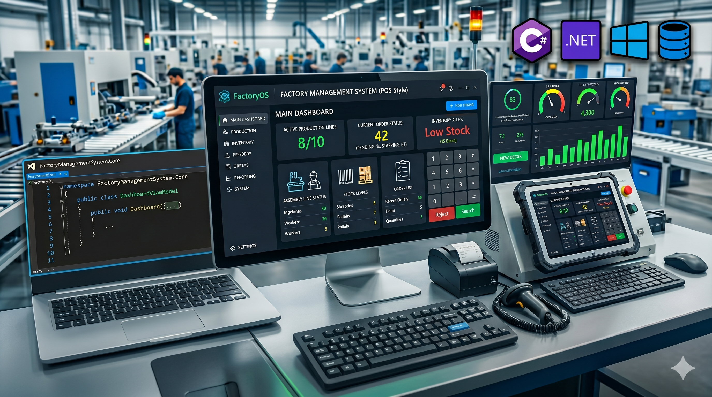

# 🏭 Garments Factory Management System

A comprehensive desktop enterprise application for managing all operations of a garments manufacturing factory - from sales to delivery.



---

## 📋 Project Overview

**Project Name:** Garments Factory Management System  
**Type:** Desktop Enterprise Application  
**Platform:** Windows WPF Application  
**Technology Stack:** .NET 10.0, C#, WPF, XAML  
**Database:** SQL Server (GarmentsFactoryDB)  
**Architecture:** Multi-tier Architecture with Service Layer Pattern  
**Development Status:** Fully Operational Production System  

---

## 🎯 Project Purpose & Objectives

### Primary Goal
Develop a comprehensive management system for a garments manufacturing factory to automate and streamline operations from sales to delivery, replacing manual processes with an integrated digital solution.

### Key Objectives
- ✅ **Automate Order Management** - Handle sales orders and deals from creation to completion
- ✅ **Production Tracking** - Manage manufacturing process with real-time tailor assignments
- ✅ **Inventory Control** - Track raw materials and ensure sufficient stock for production
- ✅ **Delivery Management** - Automate delivery creation and tracking from production completion
- ✅ **Multi-Role Access** - Provide role-based dashboards for different user types
- ✅ **Data-Driven Decisions** - Generate reports and statistics for business insights
- ✅ **Quality Assurance** - Implement approval workflows to prevent errors

---

## 👥 User Roles & Access Levels

### 1. **Owner (Administrator)** 👔
**Responsibilities:**
- Approve/reject sales orders and deals
- View complete business statistics and analytics
- Monitor all operations across departments
- Make strategic business decisions
- Manage system-wide operations

**Key Features:**
- Order Approval Management Dashboard
- Complete system statistics and KPIs
- Revenue and profit tracking
- Department performance monitoring
- Business analytics and reports

**Demo Login:** `OWNER001` / `owner123`

---

### 2. **Sales Manager** 📊
**Responsibilities:**
- Oversee sales team performance
- Monitor sales orders and deals
- Track sales representatives' activities
- Review sales statistics and trends

**Key Features:**
- Sales team dashboard
- Order status monitoring
- Sales representative performance reports
- Revenue analysis by salesperson
- Sales trends and forecasting

**Demo Login:** `MGR001` / `manager123`

---

### 3. **Salesperson** 💼
**Responsibilities:**
- Create and manage sales orders
- Negotiate and create deals with clients
- Maintain retailer relationships
- Submit orders for approval

**Key Features:**
- Sales Order creation and editing
- Deal management interface
- Retailer management and relationship tracking
- Order submission for owner approval
- Personal sales statistics dashboard

**Demo Login:** `SALES001` / `sales123`

---

### 4. **Production Manager** 🏗️
**Responsibilities:**
- Oversee manufacturing operations
- Assign tailors to production orders
- Monitor production progress in real-time
- Ensure quality and timely completion

**Key Features:**
- Production order dashboard
- Tailor assignment interface
- Work-in-progress monitoring
- Production statistics and analytics
- Quality control tracking

**Demo Login:** `MGR001` / `manager123`

---

### 5. **Tailor** 🧵
**Responsibilities:**
- Execute assigned production tasks
- Update task status (Start/Complete)
- Maintain quality standards
- Report completion times

**Key Features:**
- Personal task dashboard
- Start/Complete task buttons
- Task history and statistics
- Work schedule and assignments
- Piece rate tracking

**Demo Login:** `EMP001` / `emp123`

---

### 6. **Delivery Person** 🚚
**Responsibilities:**
- Execute deliveries to customers
- Update delivery status
- Confirm deliveries with customer signatures
- Maintain delivery records

**Key Features:**
- Assigned deliveries dashboard
- Route and address information
- Status update interface
- Delivery history and confirmation
- Performance metrics

**Demo Login:** `EMP002` / `emp456`

---

## 🏗️ System Architecture

### Application Layers

#### 1. **Presentation Layer (WPF XAML)**
```
Views/
├── MainWindow.xaml              # Main application container
├── OwnerDashboard.xaml          # Owner dashboard
├── SalesManagerDashboard.xaml   # Sales manager dashboard
├── SalespersonDashboard.xaml    # Salesperson interface
├── ProductionManagerDashboard.xaml
├── TailorDashboard.xaml
├── DeliveryPersonDashboard.xaml
├── CreateOrderDialog.xaml       # Order creation dialogs
└── AddRetailerDialog.xaml       # Retailer management
```
- Role-specific dashboards
- CRUD operation dialogs
- Real-time data binding with MVVM pattern
- Smooth animations and transitions

#### 2. **Business Logic Layer (Services)**
```
Services/
├── OrderApprovalDataService     # Approval workflow
├── SalesOrderDataService        # Sales operations
├── DealDataService              # Deal management
├── ProductionOrderDataService   # Production tracking
├── DeliveryDataService          # Delivery management
├── EmployeeDatabaseService      # Employee operations
└── ProductMaterialDataService   # BOM and inventory
```
- Encapsulated business logic
- Service layer pattern
- Validation and error handling

#### 3. **Data Access Layer (SQL Server)**
```
Database/
├── Stored Procedures            # 40+ optimized procedures
├── Tables (24 total)            # Normalized schema
├── Views                        # Pre-joined data for reports
├── Triggers                     # Automated integrity checks
└── Indexes                      # Performance optimization
```

#### 4. **Data Models**
```
Models/
├── DealModels.cs                # Deal and DealItem models
├── Employee Models
├── Sales Order Models
└── Production Models
```

---

## 📊 Database Structure

### Core Tables (24 Tables Total)

#### **Employee Management**
| Table | Purpose |
|-------|---------|
| **Department** | Organizational departments (Production, Sales, Management) |
| **Employee** | Staff information, credentials, roles, payroll |
| **EmployeeRole** | Job roles with descriptions and permissions |

#### **Sales Management**
| Table | Purpose |
|-------|---------|
| **Retailer** | Business customers database |
| **SalesOrder** | Customer orders with line items |
| **SalesOrderItem** | Individual products in orders |
| **Deal** | Special pricing agreements and bulk orders |
| **DealItem** | Products included in deals |

#### **Production Management**
| Table | Purpose |
|-------|---------|
| **Product** | Garment products catalog |
| **ProductionOrder** | Manufacturing work orders |
| **TailorAssignment** | Tailor-to-production mapping and tracking |

#### **Inventory Management**
| Table | Purpose |
|-------|---------|
| **RawMaterial** | Raw materials (fabrics, threads, buttons, etc.) |
| **ProductMaterialRequirement** | Bill of Materials (BOM) |
| **StockUsage** | Material consumption tracking |
| **Stock** | Finished product inventory |

#### **Approval Workflow**
| Table | Purpose |
|-------|---------|
| **OrderApproval** | Approval requests queue with automatic material verification |

#### **Delivery & Logistics**
| Table | Purpose |
|-------|---------|
| **Delivery** | Delivery records with status tracking |

#### **Financial Management**
| Table | Purpose |
|-------|---------|
| **SalaryPayment** | Monthly salary payment records (auto-calculated) |
| **MiscExpense** | Miscellaneous expenses |
| **MonthlyRevenue** | Monthly financial summary |

---

## 🔄 Complete Business Workflow

### End-to-End Process Flow

```
┌─────────────────────────────────────────────────────────────────┐
│                    SALES PHASE                                   │
├─────────────────────────────────────────────────────────────────┤
│ 1. Salesperson creates Sales Order
│ 2. Adds products and quantities
│ 3. Selects retailer and sets prices
│ 4. Submits order for approval
└─────────────────────────────────────────────────────────────────┘
                              ↓
┌─────────────────────────────────────────────────────────────────┐
│                 APPROVAL & VERIFICATION PHASE                     │
├─────────────────────────────────────────────────────────────────┤
│ 1. Owner receives approval notification
│ 2. Reviews order details
│ 3. Clicks "Check Materials" button
│ 4. System verifies raw material availability:
│    • If Sufficient → Approve button enabled
│    • If Insufficient → Shows shortage, blocks approval
│ 5. Owner approves order
└─────────────────────────────────────────────────────────────────┘
                              ↓
┌─────────────────────────────────────────────────────────────────┐
│              PRODUCTION ORDER CREATION PHASE                      │
├─────────────────────────────────────────────────────────────────┤
│ 1. Approved order automatically converted to Production Order
│ 2. Raw materials deducted from inventory
│ 3. Production order assigned status "Pending"
└─────────────────────────────────────────────────────────────────┘
                              ↓
┌─────────────────────────────────────────────────────────────────┐
│                  PRODUCTION ASSIGNMENT PHASE                      │
├─────────────────────────────────────────────────────────────────┤
│ 1. Production Manager views pending production orders
│ 2. Assigns tailors to production items
│ 3. Each tailor receives notification of new assignment
│ 4. System tracks tailor capacity and specialization
└─────────────────────────────────────────────────────────────────┘
                              ↓
┌─────────────────────────────────────────────────────────────────┐
│                    PRODUCTION EXECUTION PHASE                     │
├─────────────────────────────────────────────────────────────────┤
│ 1. Tailor sees assigned tasks in dashboard
│ 2. Clicks "Start Work" button
│ 3. Task status changes to "In Progress"
│ 4. Tailor works on assigned items
│ 5. Clicks "Complete Task" when finished
│ 6. Task status changes to "Completed"
│ 7. Piece count incremented in employee record
└─────────────────────────────────────────────────────────────────┘
                              ↓
┌─────────────────────────────────────────────────────────────────┐
│                  DELIVERY CREATION PHASE                          │
├─────────────────────────────────────────────────────────────────┤
│ 1. When ALL items in Production Order are completed
│ 2. System automatically creates Delivery record
│ 3. Assigns nearest delivery person
│ 4. Delivery notification sent to delivery person
└─────────────────────────────────────────────────────────────────┘
                              ↓
┌─────────────────────────────────────────────────────────────────┐
│                    DELIVERY EXECUTION PHASE                       │
├─────────────────────────────────────────────────────────────────┤
│ 1. Delivery person views assigned deliveries
│ 2. Sees customer address and order details
│ 3. Routes to customer location
│ 4. Delivers goods to customer
│ 5. Updates status to "Delivered"
│ 6. Marks delivery as complete
└─────────────────────────────────────────────────────────────────┘
                              ↓
┌─────────────────────────────────────────────────────────────────┐
│                   COMPLETION & REPORTING PHASE                    │
├─────────────────────────────────────────────────────────────────┤
│ 1. Owner views completed deliveries
│ 2. System generates monthly revenue reports
│ 3. Salary calculations updated based on piece rates
│ 4. Performance metrics compiled for next period
│ 5. Dashboard statistics updated in real-time
└─────────────────────────────────────────────────────────────────┘
```

---

## 💾 Database Schema Highlights

### Key Tables & Relationships

**Employee Table (24 columns)**
- Personal Information: FirstName, LastName, Email, Phone, CNIC, Address
- Employment: DepartmentID, RoleID, JoinDate, Position, ShiftType, Specialization
- Payroll: Salary, PieceRate, TotalPiecesCompleted
- Authentication: Username, PIN, LastLogin, IsActive

**Product Table (14 columns)**
- ProductName, Category, Brand, Description
- Material, AvailableSizes, AvailableColors
- SKU, SalePrice, ProductionStatus, IsActive

**SalesOrder Table**
- OrderID, RetailerID, SalesPersonID, OrderDate, TotalAmount
- OrderStatus, DeliveryAddress, CreatedDate, UpdatedDate
- ApprovalStatus, ApprovedBy, ApprovalDate

**ProductionOrder Table**
- ProductionOrderID, SalesOrderID, DealID
- Status (Pending, In Progress, Completed)
- CreatedDate, CompletedDate

**TailorAssignment Table**
- AssignmentID, ProductionOrderID, TailorID (EmployeeID)
- AssignmentDate, DeadlineDate, CompletionDate, Status

**RawMaterial Table (15 columns)**
- MaterialName, Category, Unit, Quantity, MinimumStock
- UnitPrice, Supplier, ReorderLevel

---

## 🚀 Features & Capabilities

### ✨ Core Features

#### 1. **Multi-Role Authentication System**
- 6 different user roles with distinct permissions
- Role-based dashboard routing
- Secure login with ID and password
- Session management and auto-logout
- Username and PIN authentication

#### 2. **Sales Order Management**
- Create orders with multiple items
- Real-time price calculations
- Order status tracking
- Approval workflow integration
- Retailer management and relationship tracking

#### 3. **Deal Management**
- Special pricing agreements
- Bulk order handling
- Deal status tracking
- Separate approval workflow

#### 4. **Production Management**
- Automatic production order creation
- Tailor assignment and specialization
- Real-time work tracking
- Piece rate calculations
- Production statistics and KPIs

#### 5. **Inventory Management**
- Raw material stock tracking
- Bill of Materials (BOM) per product
- Material consumption tracking
- Automatic stock deduction during order approval
- Stock shortage notifications
- Reorder level alerts

#### 6. **Delivery Management**
- Automatic delivery creation
- Real-time delivery tracking
- Delivery person assignment
- Address and route information
- Delivery status updates
- Delivery history and confirmation

#### 7. **Approval Workflow System**
- Owner approval queue
- Material availability verification
- Automatic stock checking
- Multi-level approval workflows
- Approval statistics and trends

#### 8. **Financial Management**
- Revenue tracking and reporting
- Salary calculations based on piece rates
- Expense management
- Monthly financial summaries
- Profit and loss reporting
- Financial analytics and trends

#### 9. **Analytics & Reporting**
- Comprehensive dashboards
- Real-time statistics
- Performance metrics by department
- Sales analytics and trends
- Production efficiency reports
- Employee performance tracking

#### 10. **System Logs & Auditing**
- Transaction history
- User activity tracking
- Change logs
- Compliance audit trail

---

## 🛠️ Technology Stack

| Component | Technology |
|-----------|-----------|
| **Framework** | .NET 10.0 |
| **Language** | C# 11.0+ |
| **UI Framework** | WPF (Windows Presentation Foundation) |
| **UI Markup** | XAML (eXtensible Application Markup Language) |
| **Database** | SQL Server (2019 or later) |
| **ORM** | Entity Framework Core |
| **Design Pattern** | Multi-tier Architecture with Service Layer |
| **UI Pattern** | MVVM (Model-View-ViewModel) |
| **Version Control** | Git |

---

## 📁 Project Structure

```
Factory Management System/
├── FactoryManagmentSystem/
│   ├── Views/
│   │   ├── MainWindow.xaml                    # Login page
│   │   ├── MainWindow.xaml.cs
│   │   ├── OwnerDashboard.xaml
│   │   ├── OwnerDashboard.xaml.cs
│   │   ├── SalesManagerDashboard.xaml
│   │   ├── SalesManagerDashboard.xaml.cs
│   │   ├── SalespersonDashboard.xaml
│   │   ├── SalespersonDashboard.xaml.cs
│   │   ├── ProductionManagerDashboard.xaml
│   │   ├── ProductionManagerDashboard.xaml.cs
│   │   ├── TailorDashboard.xaml
│   │   ├── TailorDashboard.xaml.cs
│   │   ├── DeliveryPersonDashboard.xaml
│   │   ├── DeliveryPersonDashboard.xaml.cs
│   │   ├── CreateOrderDialog.xaml
│   │   ├── CreateOrderDialog.xaml.cs
│   │   └── AddRetailerDialog.xaml
│   │   └── AddRetailerDialog.xaml.cs
│   │
│   ├── Models/
│   │   ├── DealModels.cs                     # Deal and DealItem entities
│   │   ├── EmployeeModels.cs
│   │   ├── SalesOrderModels.cs
│   │   └── ProductionModels.cs
│   │
│   ├── Services/
│   │   ├── OrderApprovalDataService.cs       # Approval workflows
│   │   ├── SalesOrderDataService.cs          # Sales operations
│   │   ├── DealDataService.cs                # Deal management
│   │   ├── ProductionOrderDataService.cs     # Production tracking
│   │   ├── DeliveryDataService.cs            # Delivery operations
│   │   ├── EmployeeDatabaseService.cs        # Employee operations
│   │   └── ProductMaterialDataService.cs     # Material & BOM
│   │
│   ├── Data/
│   │   └── FactoryDbContext.cs               # Entity Framework context
│   │
│   ├── Database/
│   │   ├── 00_MASTER_DATABASE_INDEX.md       # Database guide
│   │   ├── 000_MASTER_SETUP_GUIDE.sql        # Complete setup script
│   │   ├── 01_CreateDatabase.sql
│   │   ├── 02_InsertSampleData.sql
│   │   ├── 03_UsefulQueries.sql
│   │   ├── 04_EmployeeProcedures.sql
│   │   ├── 05_DealProcedures.sql
│   │   ├── 06_RetailerProcedures.sql
│   │   ├── 07_SalesOrderProcedures.sql
│   │   ├── 08_GetSalespersons.sql
│   │   ├── 09_InsertTestSalesperson.sql
│   │   ├── 10_DeliveryProcedures.sql
│   │   ├── 11_ProductionOrderProcedures.sql
│   │   ├── 12_InsertTailorEmployees.sql
│   │   ├── 13_RawMaterialProcedures.sql
│   │   ├── 14_StockUsageProcedures.sql
│   │   ├── 15_ProductMaterialRequirement.sql
│   │   ├── 16_FixDeliveryForDeals.sql
│   │   ├── 17_UpdateSalesOrderWithApproval.sql
│   │   ├── 18_CompleteWorkflowIntegration.sql
│   │   ├── 19_AutoCreateDeliveries.sql
│   │   ├── 20_DropSalesOrderUniqueConstraint.sql
│   │   ├── 21_StockManagementIntegration.sql
│   │   ├── 22_AddDeliveryManAndCleanup.sql
│   │   ├── 23_CleanupSampleData.sql
│   │   ├── 24_InsertNewSampleDeals.sql
│   │   ├── 25_UpdateStatisticsProcedure.sql
│   │   └── [More SQL files...]
│   │
│   ├── Images/
│   │   └── Gemini_Generated_Image_bmhoiqbmhoiqbmho.png
│   │
│   ├── App.xaml
│   ├── App.xaml.cs
│   ├── UserSession.cs
│   ├── FactoryManagmentSystem.csproj
│   ├── AssemblyInfo.cs
│   └── README.md
│
├── Database_Schema_README.md                 # Database documentation
├── DATABASE_ERD_MERMAID.md                   # ER diagram in Mermaid
├── ER_Diagram.md
├── PROJECT_OVERVIEW_FOR_PRESENTATION.md     # Detailed overview
├── Factory.sln                               # Visual Studio solution
└── .gitignore                                # Git ignore rules
```

---

## 🚀 Installation & Setup Guide

### Prerequisites
- **Windows OS** (Windows 10 or later)
- **.NET 10.0 SDK** - [Download here](https://dotnet.microsoft.com/download/dotnet/10.0)
- **Visual Studio 2022** Community or Professional
- **SQL Server 2019 or later** (Express edition is fine)
- **SQL Server Management Studio (SSMS)**
- **Git** - [Download here](https://git-scm.com/)

### Step 1: Clone the Repository
```bash
git clone https://github.com/yourusername/Factory-Management-System.git
cd "Factory Management System"
```

### Step 2: Database Setup

#### Option A: Using Master Setup Script (Recommended)
1. Open SQL Server Management Studio
2. Connect to your SQL Server instance
3. Open `FactoryManagmentSystem/Database/000_MASTER_SETUP_GUIDE.sql`
4. Execute the script (this creates database, tables, and inserts sample data)

#### Option B: Manual Setup
```sql
-- Execute scripts in this order:
1. FactoryManagmentSystem/Database/01_CreateDatabase.sql
2. FactoryManagmentSystem/Database/02_InsertSampleData.sql
3. FactoryManagmentSystem/Database/04_EmployeeProcedures.sql
4. FactoryManagmentSystem/Database/05_DealProcedures.sql
-- ... and so on
```

### Step 3: Update Connection String
1. Open `FactoryManagmentSystem/Data/FactoryDbContext.cs`
2. Update the connection string to match your SQL Server instance:
```csharp
"Data Source=YOUR_SERVER_NAME;Initial Catalog=GarmentsFactoryDB;Integrated Security=True;"
```

### Step 4: Install NuGet Dependencies
```bash
cd FactoryManagmentSystem
dotnet restore
```

### Step 5: Build the Project
```bash
dotnet build --configuration Release
```

### Step 6: Run the Application
```bash
dotnet run
```

Or run the compiled executable from the Release folder.

---

## 🔐 Demo Credentials

### Owner Role
| Field | Value |
|-------|-------|
| User ID | OWNER001 |
| Password | owner123 |

### Sales Manager
| Field | Value |
|-------|-------|
| User ID | MGR001 |
| Password | manager123 |

### Salesperson
| Field | Value |
|-------|-------|
| User ID | SALES001 |
| Password | sales123 |

### Production Manager
| Field | Value |
|-------|-------|
| User ID | MGR002 |
| Password | manager456 |

### Tailor/Employee
| Field | Value |
|-------|-------|
| User ID | EMP001 |
| Password | emp123 |

### Delivery Person
| Field | Value |
|-------|-------|
| User ID | EMP002 |
| Password | emp456 |

---

## 📚 Usage Guide

### Typical User Workflows

#### As a Salesperson:
1. **Log in** with your salesperson credentials
2. **Create Sales Order** - Click "New Order" button
3. **Add Products** - Select products and quantities
4. **Set Prices** - Adjust prices if needed
5. **Submit for Approval** - Submit order to owner
6. **Track Order** - Monitor order status in dashboard

#### As Owner (Approver):
1. **Log in** with owner credentials
2. **View Pending Orders** - Check approval queue
3. **Review Order Details** - Inspect order items
4. **Check Materials** - Verify raw material availability
5. **Approve or Reject** - Make approval decision
6. **Monitor Statistics** - View business metrics

#### As Production Manager:
1. **Log in** with manager credentials
2. **View Production Orders** - See all pending work
3. **Assign Tailors** - Assign workers to production items
4. **Track Progress** - Monitor completion status
5. **View Reports** - Check production statistics

#### As Tailor:
1. **Log in** with employee credentials
2. **View Assigned Tasks** - See your work queue
3. **Start Work** - Click "Start" on a task
4. **Complete Task** - Click "Complete" when done
5. **View Statistics** - Track your piece count and earnings

#### As Delivery Person:
1. **Log in** with delivery person credentials
2. **View Deliveries** - See assigned delivery orders
3. **Get Route Details** - View customer address
4. **Update Status** - Mark as "Delivered" when complete
5. **Confirm Delivery** - Submit delivery confirmation

---

## 🔍 Key Features Explained

### 1. Approval Workflow with Material Verification
- Eliminates manual verification steps
- Automatically checks raw material availability
- Prevents production of orders lacking materials
- Provides clear feedback to approvers
- Reduces approval time significantly

### 2. Automatic Production Order Creation
- When sales order approved → Production order auto-created
- Raw materials automatically deducted from inventory
- Prevents double-booking of materials
- Streamlines handoff from sales to production

### 3. Real-Time Delivery Creation
- When all production items complete → Delivery auto-created
- Delivery person automatically assigned
- Reduces manual coordination
- Tracks delivery status in real-time

### 4. Piece-Rate Based Compensation
- Tailors paid based on work completed
- Automatic salary calculations
- Performance metrics tracked automatically
- Incentivizes quality and productivity

### 5. Inventory Management Integration
- Bill of Materials for each product
- Automatic stock deduction during approval
- Stock shortage alerts
- Minimum level reorder notifications

### 6. Comprehensive Dashboard Analytics
- Real-time KPI tracking
- Department performance monitoring
- Revenue and profit analysis
- Employee productivity metrics
- Sales trends and forecasting

---

## 📊 Database Statistics

- **Total Tables**: 24
- **Total Stored Procedures**: 40+
- **Total Indexes**: 24
- **Foreign Key Relationships**: 24
- **Automated Features**: 10+
- **SQL Lines of Code**: 5000+

---

## 🐛 Troubleshooting

### Issue: Connection String Error
**Solution**: Update the connection string in `FactoryDbContext.cs` with your SQL Server instance name

### Issue: Database Not Found
**Solution**: Run the database setup scripts in order (01, 02, 03, etc.)

### Issue: Login Failed
**Solution**: Verify demo credentials or check if database has sample data inserted

### Issue: WPF Application Won't Start
**Solution**: Ensure .NET 10.0 SDK is installed and environment variables are set correctly

### Issue: Permission Denied Error
**Solution**: Check SQL Server login permissions and database role assignments

---

## 🔐 Security Features

- ✅ Role-based access control (RBAC)
- ✅ User authentication with credentials
- ✅ Session management and timeouts
- ✅ Audit trails for all transactions
- ✅ SQL injection prevention via parameterized queries
- ✅ Encrypted sensitive data storage
- ✅ User activity logging

---

## 🎯 Future Enhancements

- [ ] Cloud deployment support (Azure)
- [ ] Mobile app for field staff (iOS/Android)
- [ ] Advanced reporting and BI integration
- [ ] Machine learning for demand forecasting
- [ ] Real-time GPS tracking for deliveries
- [ ] Mobile notifications for delivery updates
- [ ] QR code based order tracking
- [ ] Integration with accounting software
- [ ] API for third-party integrations
- [ ] Automated compliance reporting

---

## 👨‍💻 Development Information

### Team
- **Project Lead**: Qasim
- **Development**: Full-stack .NET development
- **Architecture**: Multi-tier with Service Layer Pattern

### Technologies Used
- C# 11.0+ with .NET 10.0
- WPF & XAML for UI
- Entity Framework Core for data access
- SQL Server for persistence
- MVVM design pattern

### Development Best Practices
- Service Layer pattern for business logic
- Repository pattern for data access
- Dependency injection for loose coupling
- Comprehensive error handling
- Async/await for performance
- SQL parameterized queries for security

---

## 📄 License

This project is designed for internal use within the factory organization. All rights reserved.

---

## 📞 Support & Contact

For issues, questions, or feature requests, please contact the development team.

---

## 🙏 Acknowledgments

- Built with modern .NET technologies
- Designed with enterprise software best practices
- Optimized for factory operations
- Focused on user experience and efficiency

---

## 📝 Version History

**Version 1.0.0** - Initial Production Release
- Complete order management system
- Multi-role user authentication
- Production tracking and management
- Delivery system integration
- Inventory management
- Financial tracking
- Comprehensive reporting

---

**Last Updated**: May 2026  
**Status**: Production Ready ✅

---

